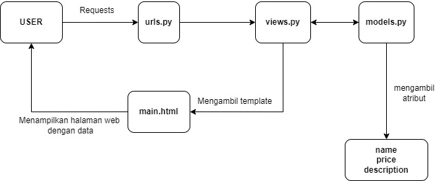

## Pengimplementasian Checklist

 - Pertama, saya membuat sebuah direktori baru pada laptop saya, menginisiasi git dengan `git init`, dan mengkonfigurasi hal-hal yang diperlukan, seperti username dan email serta autentikasi.
 - Setelah itu, saya menginisiasi repositori di GitHub dan membuat file README.md sebagai commit pertama.
 - Setelah melakukan kedua langkah di atas, saya membuat branch utama baru terlebih dahulu `git branch -M main` dan menghubungkan repositori lokal dengan repositori di GitHub dengan `git remote add origin https://github.com/daavidjuan/Sugeng-Avenue.git`, kemudian saya melakukan push pada branch utama tersebut.
 - Saya memutuskan untuk melakukan cloning pada repositori ini ke komputer lokal, sehingga saya menjalankan perintah `git clone` di direktori berbeda dari yang sedang dikerjakan.
 - Setelah semua langkah di atas dilakukan, saya membuat virtual environment dengan perintah `python -m venv env` dan mengaktifkannya dengan `env\Scripts\activate`.
 - Di dalam direktori utama, saya membuat sebuah file bernama 'requirements.txt' dan mengisi file tersebut dengan sebuah dependencies yaitu
 '''
  django
  gunicorn
  whitenoise
  psycopg2-binary
  requests
  urllib3
 '''
- Instalasi dependencies dilakukan dengan menjalankan perintah `pip install -r requirements.txt`. Setelah itu, saya membuat sebuah project Django baru bernama 'Sugeng_Avenue' dengan perintah `django-admin startproject Sugeng_Avenue .`.
- Kemudian, saya menambahkan string "localhost, "127.0.0.1" pada ALLOWED_HOST di settings.py dan menonaktifkan virtual environment dengan perintah `deactivate`
- Setelah itu, saya menambahkan berkas `.gitignore` yang berisikan konfigurasi yang digunakan dalam repositori Git untuk menentukan berkas-berkas dan direktori-direktori yang harus diabaikan oleh Git. Kemudian saya melakukan `add, commit, dan push`.
  
  ### Membuat Aplikasii Django
  - Pertama, saya mengaktifkan virtual environment dengan perintah `env\Scripts\activate`. Setelah itu saya menjalankan perintah `python manage.py startapp main` untuk membuat aplikasi baru bernama main.
  - Setelah itu, saya mendaftarkan aplikasi main ke dalam project dengan menambahkan string 'main' pada file `settings.py` di dalam direktori project 'Sugeng-Avenue'.
  - Kemudian, saya membuat direktori baru bernama 'templates' di dalam direktori aplikasi main dan di dalamnya saya membuat file bernama `main.html` yang berisi `name, price, dan description`.
  - Setelah selesai membuat templates, saya melanjutkan dengan membuat models. Models dibuat dengan mengisi berkas `models.py` dengan atribut name, price, dan description dengan tipe data sesuai apa yang diperlukan.
  - Kemudian, saya melakukan migrasi model dengan perintah `python manage.py makemigrations` kemudian menerapkan migrasi ke dalam basis data lokal dengan `python manage.py migrate`.
 
  ### Mengintegrasikan Komponen MVT
  - Pengintegrasian dilakukan dengan menambahkan `from django.shortcuts import render` pada file `views.py`. Kemudian dalam file tersebut ditambahkan fungsi `show_main` yang berisikan komponen yang diperlukan dalam models, yaitu `name, price, dan description` dari product.
  - Dalam `views.py`, terdapat perintah `return render(request, "main.html", context)` yang menghubungkan views dengan template HTML, function show_main menerima parameter request yang akan mengatur permintaan HTTP dan mengembalikan tampilan yang sesuai.
  - Kemudian, saya memodifikasi file `main.html` pada `templates` kemudian mengubah isinya dengan {{ name }}, {{ price }}, {{ description }}.
  - Kemudian saya membuat urls.py pada direktori aplikasi main untuk memetakan function pada views.py, dalam urls.py terdapat function path yang menerima parameter ' ' agar halaman aplikasi tersebut muncul pada halaman utama localpath.
  - Kemudian saya mengisi file test.py untuk melakukan unit testing. Setelah itu menjalankan perintah `python manage.py test`
work Django sebagai Permulaan
Sebagai permulaan, penggunaan bahasa python sangat memudahkan para penggunanya karena bahasa python jauh lebih mudah untuk dikenal bagi para pemula. Sebagai mahasiswa yang baru menjalankan 1 tahun perkuliahan di Fasilkom, saya merasa tidak terlalu kesulitan ketika menulis kode dengan bahasa python. Kemudian, Django juga memiliki tutorial dan sumber daya yang banyak untuk mendukung pembelajaran. Django telah digunakan untuk membangun berbagai macam aplikasi web, menunjukkan bahwa Django adalah framework yang dapat diandalkan untuk sebuah project.

## Alasan model Django disebut sebagai ORM
Model Django adalah sebuah representasi objek dari data yang akan disimpan ke dalam database. Sebagai contoh, dalam model saya di atas, terdapat atribut name, price, dan description, Django akan membuat tabel model tersebut dengan kolom name, price, dan description. Selain itu, ORM Django terintegrasi secara erat dengan framework Django lainnya, sehingga memudahkan para pengguna juga untuk memabangun sebuah aplikasi web. ORM pada Django memungkinkan pengembangan aplikasi berbasis data menjadi lebih sederhana, cepat, dan mudah dipahami oleh para penggunanya.

 ### Deployment PWS
 - Karena sudah memiliki akun, saya membuat sebuah project baru bernama Sugeng-Avenue. Kemudian mengganti kode pada settings.py di proyek Django yang sudah kamu buat tadi, tambahkan URL deployment PWS pada ALLOWED_HOSTS.
 - Kode yang diubah menjadi `ALLOWED_HOSTS = ["localhost", "127.0.0.1", "david-juan-sugengavenue.pbp.cs.ui.ac.id"]`. Kemudian saya melakukan `add, commit, dan push`.
 - Setelah itu, saya mengubah nama branch utama menjadi main dengan `git branch -M main`. Kemudian melakukan `push` ke PWS dengan `git push pws main:master`.

## BAGAN

## Fungsi Git dalam Pengembangan Perangkat Lunak
Git memungkinkan para penggunanya untuk dapat bekerja secara kolaboratif atau bekerja sama bersama kelompok, melacak setiap perubahan yang dibuat, dan mengelola perubahan yang terjadi pada kode dari waktu ke waktu. Git memiliki fitur dimana memungkinkan pemilik kode untuk membuat branch untuk mengerjakan fitur atau perbaikan secara terpisah dari branch utama, meminimalisir terjadinya error pada branch utama. 

## Pemilihan Frame